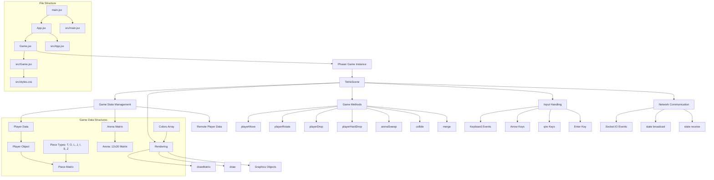

# Client Components Structure

This document describes the client-side component structure and organization of the codex_tetoris application.

## Component Hierarchy

The client application follows a clear component hierarchy:

1. **main.jsx**: Application entry point
2. **App.jsx**: Root component with title and game container
3. **Game.jsx**: Main game component containing Phaser integration
4. **TetrisScene**: Phaser scene class handling game logic

## Component Structure Diagram

## Key Components

### React Components

#### main.jsx
- Application bootstrap and root element mounting
- Imports React StrictMode for development warnings
- Renders the App component

#### App.jsx
- Simple wrapper component with application title
- Renders the Game component
- Minimal UI structure

#### Game.jsx
- Main game component containing Phaser integration
- Manages Phaser game instance lifecycle
- Handles React-Phaser bridge

### Phaser Components

#### TetrisScene
- Main game scene extending Phaser.Scene
- Handles all game logic and rendering
- Manages player input and game state

## Game State Management

The game state is managed within the TetrisScene class:

- **Player Data**: Current player position, piece, and score
- **Arena Matrix**: 12x20 grid representing the game board
- **Remote Player Data**: Opponent's game state for multiplayer
- **Game Timing**: Drop intervals and animation timers

## Input System

The input system handles various keyboard events:

- **Arrow Keys**: Move pieces left/right/down
- **Q/W Keys**: Rotate pieces counterclockwise/clockwise
- **Enter Key**: Restart game after game over

## Network Integration

Socket.IO integration for real-time multiplayer:

- **State Broadcasting**: Send local game state to server
- **State Receiving**: Update remote player display
- **Event Handling**: Manage connection and disconnection events 