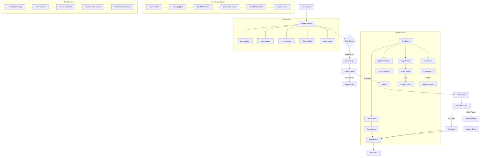

# Game Logic and Methods

This document describes the core game logic, methods, and their relationships in the codex_tetoris application.

## Overview

The game logic is implemented within the `TetrisScene` class, which extends `Phaser.Scene`. It handles all game mechanics including piece movement, collision detection, line clearing, and score management.

## Game Loop

The game follows a standard game loop pattern:

1. **Update**: Process input and update game state
2. **Collision Detection**: Check for valid moves and game over conditions
3. **Line Clearing**: Remove completed lines and update score
4. **Rendering**: Draw the current game state
5. **Network Sync**: Broadcast state changes to other players

## Game Logic Flow Diagram



## Core Methods

### Game State Management

#### `playerReset()`
- Generates a new random piece
- Resets piece position to top of board
- Checks for game over condition

#### `merge(arena, player)`
- Merges the current piece into the arena
- Permanently places the piece on the board
- Triggers line clearing check

#### `collide(arena, player)`
- Checks if a piece can be placed at a given position
- Returns true if collision detected
- Used for movement and rotation validation

### Movement Methods

#### `playerMove(dir)`
- Moves the current piece horizontally
- Validates move using collision detection
- Updates piece position if valid

#### `playerRotate(dir)`
- Rotates the current piece clockwise or counterclockwise
- Validates rotation using collision detection
- Updates piece matrix if valid

#### `playerDrop()`
- Moves the current piece down one row
- Merges piece if collision detected
- Triggers new piece generation

#### `playerHardDrop()`
- Instantly drops piece to the bottom
- Finds the lowest valid position
- Immediately merges the piece

### Line Clearing

#### `arenaSweep()`
- Scans the arena for completed lines
- Removes completed lines from the board
- Updates score based on lines cleared
- Shifts remaining blocks down

### Rendering

#### `drawMatrix(matrix, offset, graphics)`
- Renders a matrix of blocks to the screen
- Handles color mapping and positioning
- Used for arena, player, and remote rendering

#### `draw()`
- Main rendering method
- Clears previous frame
- Draws arena, current piece, and remote player
- Updates UI text and score display

## Game State Structure

### Arena
- **Dimension**: 12x20 matrix
- **Data Type**: Integer array (0 = empty, 1-7 = piece types)
- **Purpose**: Represents the game board with placed pieces

### Player Object
```javascript
{
  pos: { x: 0, y: 0 },    // Current piece position
  matrix: [[1,1,1],[0,1,0]], // Current piece shape
  score: 0,                // Player's score
  lines: 0                 // Lines cleared
}
```

### Piece Types
- **T-piece**: T-shaped (type 1)
- **O-piece**: Square (type 2)
- **L-piece**: L-shaped (type 3)
- **J-piece**: Reverse L (type 4)
- **I-piece**: Line (type 5)
- **S-piece**: S-shaped (type 6)
- **Z-piece**: Z-shaped (type 7)

## Input Handling

### Keyboard Events
- **Arrow Left/Right**: Horizontal movement
- **Arrow Down**: Soft drop (faster fall)
- **Q Key**: Rotate counterclockwise
- **W Key**: Rotate clockwise
- **Enter**: Restart game after game over

### Input Processing
1. **Event Capture**: Phaser handles keyboard input
2. **Validation**: Check if move is valid
3. **State Update**: Update game state if valid
4. **Rendering**: Redraw with new state
5. **Network Sync**: Broadcast changes to other players

## Scoring System

### Line Clear Scoring
- **1 Line**: 40 points
- **2 Lines**: 100 points
- **3 Lines**: 300 points
- **4 Lines (Tetris)**: 1200 points

### Additional Features
- **Score Display**: Real-time score updates
- **Line Counter**: Tracks total lines cleared
- **Game Over**: Stops game when pieces reach the top

## Network Integration

### State Broadcasting
- **Trigger**: Any significant game state change
- **Data**: Complete player object with position, matrix, and score
- **Frequency**: Real-time updates on every change

### Remote Player Display
- **Position**: Right side of the screen
- **Updates**: Reflects remote player's current state
- **Rendering**: Same drawing methods as local player 