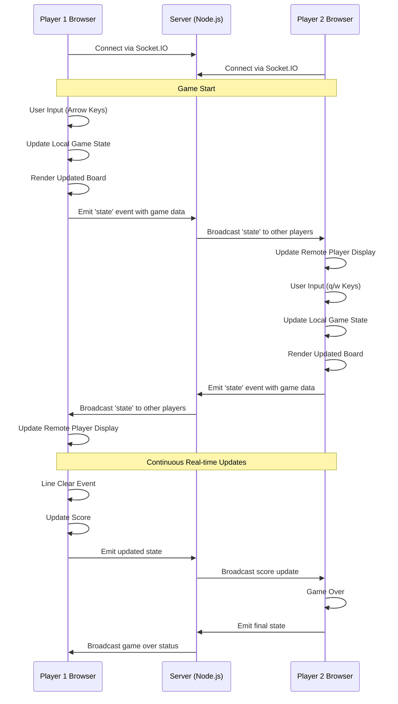

# Multiplayer Data Flow

This document describes the real-time multiplayer communication flow between players in the codex_tetoris application.

## Overview

The multiplayer system uses WebSocket connections via Socket.IO to enable real-time communication between players. The server acts as a relay, broadcasting game state changes to all connected clients.

## Communication Flow

The multiplayer system follows a simple broadcast pattern:

1. **Connection**: Players connect to the server via Socket.IO
2. **State Updates**: Each player sends their game state to the server
3. **Broadcasting**: Server broadcasts state changes to all other players
4. **Synchronization**: Players update their displays with remote player data

## Data Flow Diagram



## Key Features

### Real-time State Synchronization
- **Immediate Updates**: Game state changes are broadcast immediately
- **Bidirectional Communication**: All players can send and receive updates
- **Automatic Relay**: Server automatically forwards state to all connected clients

### Game State Data

The game state includes:
- **Player Position**: Current piece position and rotation
- **Arena State**: Complete game board matrix
- **Score Information**: Current score and lines cleared
- **Game Status**: Playing, game over, or paused states

### Network Events

#### Client Events
- **'state'**: Emitted when local game state changes
- **Connection**: Automatic on page load
- **Disconnection**: Automatic on page close

#### Server Events
- **'state'**: Broadcasted to all other connected clients
- **Connection Handling**: Manages new player connections
- **Broadcast Logic**: Relays messages to appropriate clients

## Implementation Details

### Client-Side (Game.jsx)
```javascript
// Socket.IO connection
const socket = io();

// Send state updates
socket.emit('state', gameState);

// Receive remote state
socket.on('state', (remoteState) => {
  this.remote = remoteState;
});
```

### Server-Side (server.js)
```javascript
// Handle connections
io.on('connection', socket => {
  // Broadcast state to other players
  socket.on('state', state => {
    socket.broadcast.emit('state', state);
  });
});
```

## Network Architecture

### Connection Management
- **WebSocket Protocol**: Uses Socket.IO for persistent connections
- **Automatic Reconnection**: Built-in reconnection handling
- **Cross-browser Support**: Works across all modern browsers

### Performance Considerations
- **Efficient Broadcasting**: Only sends state changes, not full game state
- **Real-time Updates**: Minimal latency for responsive gameplay
- **Scalable Design**: Can support multiple simultaneous games

## Future Enhancements

The current implementation provides a foundation for:
- **Room-based Games**: Separate game rooms for different matches
- **Player Authentication**: User accounts and game history
- **Enhanced Game Features**: Attack mechanics and special moves
- **Spectator Mode**: Allow players to watch ongoing games 