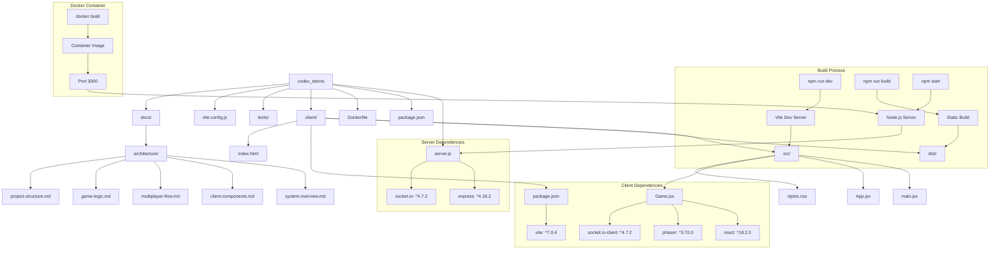

# Project Structure

This document describes the file structure, dependencies, and build process of the codex_tetoris project.

## Overview

The project follows a modern JavaScript application structure with separate client and server workspaces. It uses npm workspaces for monorepo management and includes Docker support for deployment.

## Directory Structure

```
codex_tetoris/
├── client/                 # React frontend application
│   ├── src/               # Source code
│   ├── dist/              # Built files
│   ├── package.json       # Client dependencies
│   └── index.html         # HTML template
├── docs/                  # Documentation
│   └── architecture/      # Architecture diagrams
├── tests/                 # Test files
├── server.js              # Node.js server
├── package.json           # Root package configuration
├── vite.config.js         # Vite build configuration
├── Dockerfile            # Docker configuration
└── README.md             # Project documentation
```

## Project Structure Diagram



## Package Configuration

### Root Package (package.json)
```json
{
  "name": "codex_tetoris",
  "version": "1.0.0",
  "description": "Tetris game with optional multiplayer",
  "main": "server.js",
  "workspaces": ["client"],
  "scripts": {
    "start": "node server.js",
    "prestart": "npm run build",
    "build": "npm run build -w client",
    "dev": "npm run dev -w client",
    "test": "echo \"No tests specified\" && exit 0"
  },
  "dependencies": {
    "express": "^4.18.2",
    "socket.io": "^4.7.2"
  }
}
```

### Client Package (client/package.json)
```json
{
  "name": "codex_tetoris_client",
  "private": true,
  "version": "0.0.0",
  "type": "module",
  "scripts": {
    "dev": "vite",
    "build": "vite build",
    "preview": "vite preview"
  },
  "dependencies": {
    "phaser": "^3.70.0",
    "react": "^18.2.0",
    "react-dom": "^18.2.0",
    "socket.io-client": "^4.7.2"
  },
  "devDependencies": {
    "@types/react": "^18.2.15",
    "@types/react-dom": "^18.2.7",
    "@vitejs/plugin-react": "^4.0.3",
    "vite": "^7.0.4"
  }
}
```

## Build Process

### Development Workflow
1. **`npm run dev`**: Starts Vite development server
2. **Hot Reload**: Automatic updates on file changes
3. **Port 3000**: Development server runs on localhost:3000

### Production Build
1. **`npm run build`**: Builds client application
2. **Static Files**: Generates optimized files in `client/dist/`
3. **`npm start`**: Starts production server serving built files

### Docker Deployment
1. **`docker build`**: Creates container image
2. **Multi-stage Build**: Optimizes container size
3. **Port 3000**: Exposes application on port 3000

## Technology Stack

### Frontend Technologies
- **React**: UI framework for component-based architecture
- **Phaser**: 2D game engine for rendering and physics
- **Vite**: Build tool for fast development and optimized builds
- **Socket.IO Client**: Real-time communication with server

### Backend Technologies
- **Node.js**: JavaScript runtime for server-side execution
- **Express**: Web framework for HTTP server and static file serving
- **Socket.IO**: WebSocket library for real-time communication

### Development Tools
- **npm Workspaces**: Monorepo management
- **Vite**: Fast build tool with HMR
- **Docker**: Containerization for deployment
- **Git**: Version control

## File Purposes

### Core Files
- **server.js**: Main server application with Express and Socket.IO
- **client/src/Game.jsx**: Main game component with Phaser integration
- **client/src/main.jsx**: React application entry point
- **client/index.html**: HTML template for React app

### Configuration Files
- **vite.config.js**: Vite build configuration
- **package.json**: Dependency and script management
- **Dockerfile**: Container build instructions

### Documentation
- **README.md**: Project overview and setup instructions
- **docs/architecture/**: Detailed architecture documentation
- **GEMINI.md**: Additional project documentation

## Deployment Options

### Local Development
- Run `npm run dev` for development server
- Automatic hot reload on file changes
- Development build with source maps

### Production Server
- Run `npm start` for production server
- Serves optimized static files
- Production build with minification

### Docker Container
- Build with `docker build -t codex_tetoris .`
- Run with `docker run -p 3000:3000 codex_tetoris`
- Self-contained deployment with all dependencies 