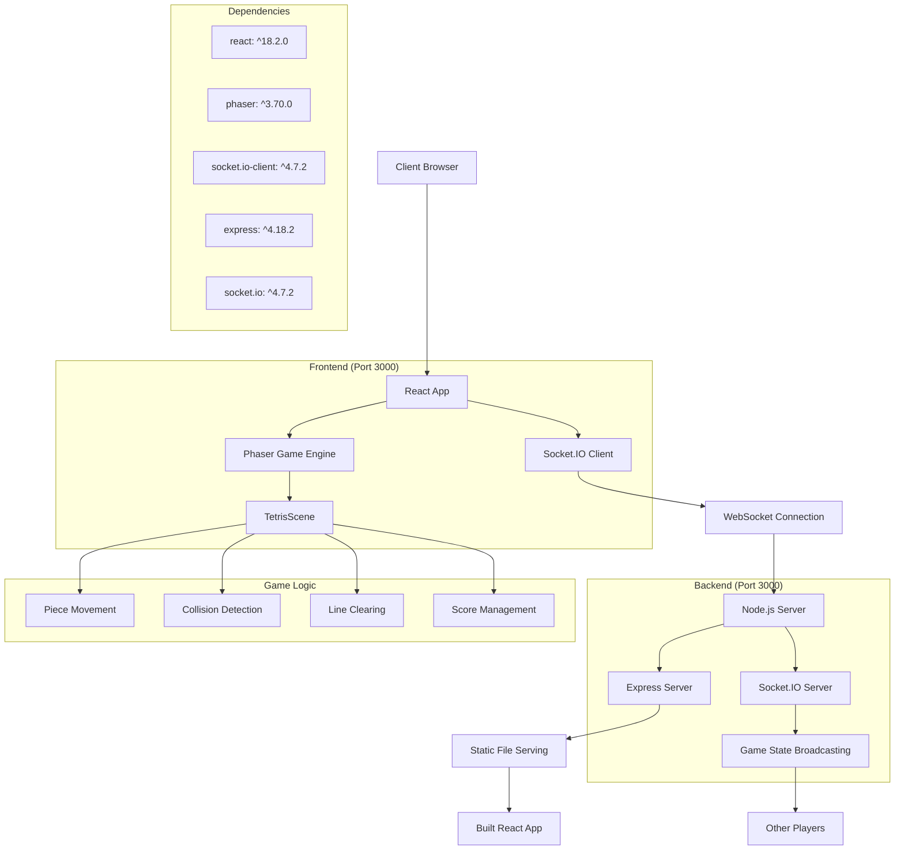

# System Overview

This document provides a high-level overview of the codex_tetoris system architecture.

## Architecture Overview

The system consists of three main layers:

1. **Frontend Layer**: React application with Phaser game engine
2. **Backend Layer**: Node.js server with Express and Socket.IO
3. **Communication Layer**: WebSocket-based real-time communication

## System Architecture Diagram

## Key Components

### Frontend Components
- **React App**: Main application framework
- **Phaser Game Engine**: Handles game rendering and physics
- **Socket.IO Client**: Manages real-time communication

### Backend Components
- **Express Server**: Serves static files and handles HTTP requests
- **Socket.IO Server**: Manages WebSocket connections and broadcasts game state
- **Game State Broadcasting**: Synchronizes game state between players

### Dependencies
- **React**: Frontend framework for UI components
- **Phaser**: 2D game engine for rendering and game logic
- **Socket.IO**: Real-time bidirectional communication
- **Express**: Web server framework 