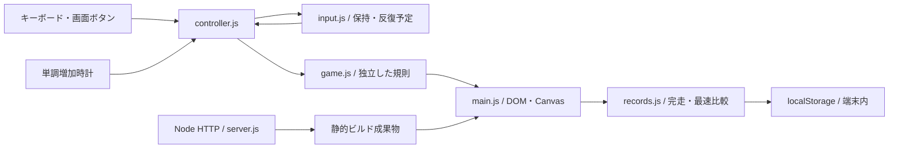

# システム構成

ひとり用の20ライン・スプリントを、静的なHTML/CSS/JavaScriptで実行します。規則のテストとブラウザの入力・描画を分け、小さなゲームを同じ出現順で再現できる構成を選びました。

```mermaid
flowchart LR
  Input[キーボード・画面ボタン] --> Controller[controller.js]
  Controller --> Repeat[input.js / 保持・反復予定]
  Repeat --> Controller
  Clock[単調増加時計] --> Controller
  Controller --> Rules[game.js / 独立した規則]
  Rules --> View[main.js / DOM・Canvas]
  View --> Records[records.js / 完走・最速比較]
  Records --> Storage[localStorage / 端末内]
  Node[Node HTTP / server.js] --> Assets[静的ビルド成果物]
  Assets --> View
```

ゲーム状態はブラウザ内にあります。サーバーはHTTP配信だけを担当します。React、Phaser、Express、Socket.IOを外し、今回の規模に必要な規則・入力・描画の境界を直接表現します。

保持入力と自然落下・固定猶予はcontrollerが同じ時計で時系列に進めます。完走への状態遷移で記録を1回保存し、schema版・規則識別子で比較条件を分離します。保存拒否でもゲームを継続でき、サーバーへ記録を送信しません。

配布と受け入れの基準はNode 20/npmです。Dockerは廃止しました。コンテナのビルド・デーモン管理を必須にする理由がないため、クリーンなLinux CIとREADMEのローカル配信手順に検証対象を絞っています。公開デプロイは対象外です。

詳細は [ゲーム仕様](../game-design.md)、[オフライン採用の判断](../offline-decision.md)、[受け入れ結果](../acceptance.md) を参照してください。
